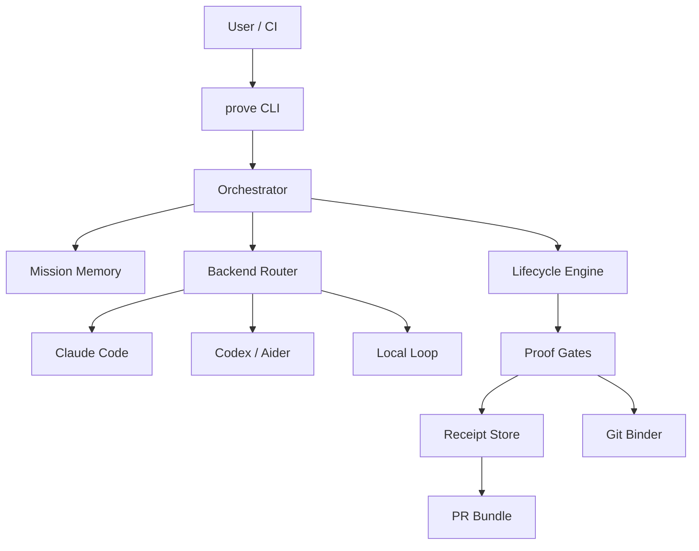

# Architecture

## Thesis

Generation is commoditized. **Admissibility of claims** is not.

Prove is a local-first control plane:

1. Multi-CLI conductor (adapters)
2. Shared mission memory
3. Proof-or-stop lifecycle
4. Git-state-bound receipts
5. PR evidence export

## Diagram

## Hard invariants

1. Backend self-reports never advance lifecycle.
2. Test admission requires Prove-spawned command results.
3. Receipts must match current head/tree + policy hashes.
4. `prove pr` refuses unless phase is done and test receipt still admits.
5. Budgets and repair limits stop honestly (Failed ≠ Done).

## Module map (Rust)

| Module | Role |
|--------|------|
| `lifecycle` | Pure FSM; illegal transitions rejected |
| `receipts` | Mint/store/admit evidence |
| `policy` | YAML gates, budgets, deny lists, hashes |
| `git_state` | Head/tree fingerprinting |
| `adapters` | naive, local-loop, claude-code, aider, codex |
| `orchestrator` | Mission loop + proof gates |
| `memory` | Structured event log + file locks |
| `eval` | Trap suite / false-done metrics |
| `store` | `.prove/` layout |

## Adapter contract

Adapters return `TurnResult` including optional `claimed_tests_passed`.  
Orchestrator **logs and ignores** that flag for lifecycle admission.
