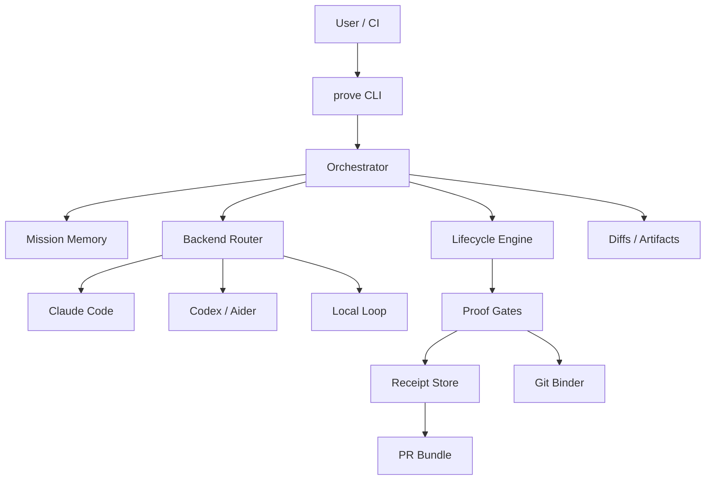
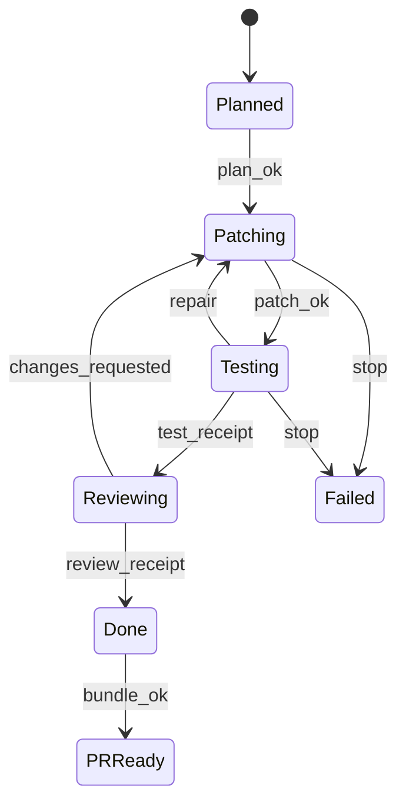

# Prove — Evidence-Gated Multi-CLI Coding Control Plane

**Working title:** Prove (`prove` CLI)  
**Tagline:** Don’t trust the agent. Trust the evidence.  
**License:** Apache-2.0  
**Goal split:** Real product architecture now; first 2–4 weeks optimized for portfolio shock + startup interview signal.

---

## 1. Problem

Startup eng teams (2–20) already run Cursor + Claude Code/Codex/Aider + CI, but:

- No shared mission memory across tools
- “Done / tests passed / reviewed” are agent self-reports
- Parallel agents thrash files and leave unverifiable PRs
- Reviewers cannot distinguish narrated success from evidence-backed success
- Cost, routing, and failure modes are opaque

**Market fact (2026):** generation is crowded (Cursor, Claude Code, Codex, Aider, Devin). **Claim admissibility** is not.

---

## 2. Product thesis

Prove is **not** another coding brain.  
It is an open-source **control plane** that:

1. Orchestrates multiple coding CLIs as backends
2. Shares mission state/memory across them
3. Advances lifecycle **only** on fresh, git-state-bound, machine-checkable receipts
4. Exports PR bundles with auditable evidence

**Dual core (equal):**
- **Proof-or-Stop lifecycle**
- **Multi-CLI conductor**

---

## 3. Positioning

| We are | We are not |
|---|---|
| Control plane / verify gate / mission bus | Cursor fork |
| Model-agnostic harness | Foundation model |
| Evidence runtime for existing agents | Fully autonomous Devin replacement |
| Local-first OSS core | Hosted-only product (later monetization) |

**One-liner for jobs:**  
“I built the missing reliability + orchestration layer for multi-agent coding stacks.”

**Viral line:**  
“Agents can claim. Only evidence can advance.”

---

## 4. Users & jobs-to-be-done

**Day-1 user:** startup eng teams already juggling Cursor + Claude Code + CI.

**Jobs:**
- Run a multi-step coding mission without fake-done
- Route work across best backend without losing context
- Get a PR a human can trust faster
- Measure agent reliability with a public trap suite

---

## 5. Architecture



### Components

| Component | Responsibility |
|---|---|
| CLI | User commands + beautiful status output |
| Orchestrator | Mission FSM, retries, budgets, handoffs |
| Backend adapters | Typed wrappers over external coding CLIs |
| Lifecycle engine | Separates claims from admitted state |
| Proof gates | Freshness, identity, command-set, exit, digests |
| Receipt store | Append-only evidence bound to git hashes |
| Mission memory | Decisions, failures, locks, constraints (structured) |
| Eval harness | Trap suite + false-done metrics |
| PR exporter | Diff + receipts + timeline |

### Trust model
- **Trust:** local git, local FS, commands Prove spawns under policy
- **Do not trust:** model prose, backend “tests passed”, stale logs, edited outputs
- **v1 sandbox:** command allowlist + dangerous-pattern deny (full OS sandbox later)

---

## 6. Lifecycle semantics



**Hard rule:** backends propose claims; only admissible receipts commit transitions.

Required receipts for `Done`:
1. `patch_receipt` (touched files + head/tree hash)
2. `test_receipt` (policy command set all exit 0, digests recorded, hashes match HEAD)
3. `review_receipt` (v1: checklist backend or second-pass review adapter; can be policy-light)

If any receipt is missing, stale (hash drift), wrong policy hash, or command-set mismatch → **no advance**.

---

## 7. Receipt schema (v1)

Content-addressed JSON in `.prove/receipts/`.

```json
{
  "receipt_id": "rec_...",
  "mission_id": "mis_...",
  "claim_type": "tests_passed",
  "head_hash": "abc...",
  "tree_hash": "def...",
  "touched_files_hash": "ghi...",
  "policy_hash": "pol_...",
  "command_set_hash": "cmd_...",
  "commands": [
    {
      "cmd": ["npm", "test", "--", "checkout"],
      "cwd": ".",
      "exit_code": 0,
      "stdout_sha256": "...",
      "stderr_sha256": "...",
      "duration_ms": 1234
    }
  ],
  "producer": {"backend": "claude-code", "run_id": "run_..."},
  "produced_at": "2026-07-25T00:00:00Z"
}
```

**Admissibility checks:**
- `head_hash` == current HEAD
- `tree_hash` == current tree
- `policy_hash` == active policy
- all `exit_code == 0` for required set
- receipt not superseded by newer conflicting event

---

## 8. Multi-CLI conductor

### Adapter interface (conceptual)
```ts
interface BackendAdapter {
  id: string
  healthcheck(): Promise<Health>
  runTurn(input: TurnInput): Promise<TurnResult>
  // TurnResult includes: changed files, summary, raw log ref, proposed claims
}
```

### v1 backends
1. **Claude Code** (required)
2. **Codex CLI or Aider** (required second; choose by local reliability)
3. **Local loop** (minimal built-in edit/test loop for demos/CI without paid CLIs)

### Router (rules, not ML)
- Surgical / git-native diff → Aider (if present)
- Deep multi-file reasoning → Claude Code
- Shell/tool-heavy → Codex
- Cheap iteration / offline → local loop
- User can pin backend per mission: `prove run --backend claude-code "..."` 

### Concurrency
- Lease locks on touched file sets in `.prove/locks/`
- One writer per overlapping file set
- Memory event written after every turn

---

## 9. Mission memory (v1, intentionally small)

Not a vector DB dump.

Structured store:
- mission goal + constraints
- plan steps + status
- failed hypotheses
- file ownership leases
- key decisions
- verify failures (command, digest, excerpt)
- backend handoff notes

API surface:
- `memory.append(event)`
- `memory.snapshot(mission_id)`
- injected into backend prompts as compact context pack

---

## 10. CLI contract

```bash
prove init
prove run "<mission>" [--backend <id>] [--budget <steps|minutes>]
prove status [mission_id]
prove verify [mission_id]
prove resume [mission_id]
prove pr [mission_id]
prove eval traps
prove adapters test
prove policy show
```

### Local data
```
.prove/
  mission.json
  events.jsonl
  memory/
  receipts/
  locks/
  policy.yml
  adapters.yml
```

### Default `policy.yml` (example)
```yaml
gates:
  test:
    commands:
      - [npm, test]
    repair_limit: 3
  review:
    type: checklist
    require: [diff_non_empty, tests_fresh, no_todo_marker]
budgets:
  max_steps: 40
  max_minutes: 45
safety:
  deny_command_regex:
    - "rm -rf /"
    - "git push --force"
```

---

## 11. Viral demo (must be week-1/2 artifact)

**Trap repo pattern:**
- Visible tests pass
- Hidden contract/integration check fails
- Naive agent marks done from visible green
- Prove blocks done until full policy command set passes on current HEAD

**30–45s script:**
1. Split screen naive vs Prove
2. Naive: “All tests passed” → fake done
3. Prove: `blocked: stale/missing test_receipt` → repair → real verify → admissible done
4. End card metric from trap suite

**Launch channels:** Show HN, Twitter/X, r/programming, r/MachineLearning, LinkedIn project post.

---

## 12. Eval harness (portfolio differentiator)

Ship `prove eval traps` with 10–20 tasks covering:
- visible-pass / hidden-fail
- stale receipt after silent file change
- command-set tamper
- backend false self-report
- partial repair then stop honesty

**Primary metrics:**
- false-done rate
- time-to-admissible-done
- repair loops to success
- stop honesty (no silent success)

Do **not** lead with saturated HumanEval cosplay. Lead with reliability/admissibility.

---

## 13. MVP scope (2–4 weeks)

### In scope
- Lifecycle engine + receipt schema/store
- Local verify runner + policy
- Claude Code adapter
- Second adapter (Codex or Aider)
- Local loop adapter
- File locks + simple router
- `run/status/verify/resume/pr/eval`
- Trap suite + demo script
- Excellent README + architecture essay
- Apache-2.0 public repo

### Out of scope
- Full IDE / VS Code extension
- Hosted team server
- Crypto signing (optional later)
- Vector memory / graph DB
- openclicky computer-use
- Training/RL
- Multi-repo enterprise features

### Weekly outcomes
| Week | Ship |
|---|---|
| 1 | Gates + receipts + verify + 1 adapter + fake-done blocked demo |
| 2 | 2nd adapter + router/locks + `prove pr` + status UX |
| 3 | Trap eval + numbers + demo video + launch README |
| 4 | Hardening, docs, public launch, job application packet |

---

## 14. Tech choice

**Default:** Rust core CLI (systems signal + solid single binary).  
**Escape hatch:** TypeScript/Bun if week-1 velocity stalls — architecture stays identical.

Supporting:
- JSONL event log
- optional SQLite later
- git via CLI or libgit2
- contract tests around gate admissibility

---

## 15. Repo layout (target)

```
prove/
  crates/ or src/
    cli/
    orchestrator/
    lifecycle/
    receipts/
    adapters/
    memory/
    eval/
  fixtures/traps/
  demos/
  docs/
    architecture.md
    trust-model.md
    roadmap.md
  README.md
  LICENSE
```

---

## 16. Job / portfolio package

Deliverables used when applying:
1. Public repo + one-command demo
2. 45s video
3. Architecture one-pager + trust model
4. Eval methodology + results
5. Code tour (gate engine, adapter, receipt verify)
6. “Next 30 days” roadmap (IDE panel, CI action, sandbox, team policies)
7. Short written post: why control plane > yet another agent

**Target employers:** AI coding startups, agent infra, developer tools, applied research eng roles valuing systems + product taste.

---

## 17. Success criteria

### Week-4 portfolio shock
- Non-expert understands value in <60s demo
- ≥2 real backends integrated
- Measurable false-done drop on trap suite
- README/design quality reads senior

### Product seeds
- External users run on real repos
- Feature requests for CI/IDE integrations
- Stars/forks + technical discussion

---

## 18. Risks & mitigations

| Risk | Mitigation |
|---|---|
| Upstream CLI brittleness | Adapter contract tests + local loop fallback |
| Scope creep to IDE/agent brain | Hard non-goals + weekly demo gate |
| Weak emotional demo | Lead with betrayal/trap narrative |
| Overbuilt memory | Structured event memory only in v1 |
| Rust velocity risk | TS escape hatch without redesign |

---

## 19. Roadmap after shock MVP

**v0.2:** GitHub Action `prove verify` on PRs  
**v0.3:** VS Code/Cursor panel reading `.prove/`  
**v0.4:** stronger sandbox + signed receipts  
**v0.5:** team policy server / shared mission bus  
**Later:** optional openclicky computer-use backend; richer code graph

---

## 20. Immediate next steps after approval

1. Write design doc to workspace (`docs/.../2026-07-25-prove-design.md`)
2. Write implementation plan (week-by-week tasks, interfaces, test plan)
3. Scaffold OSS repo + trap fixture + skeleton CLI
4. Implement gate/receipt core first (demo value before adapter polish)
5. Record demo as soon as fake-done block works

---

## Decision summary (locked)

- **Primary win:** real product design + 2–4 week portfolio shock
- **Wedge:** Proof-or-Stop + Multi-CLI conductor (dual core)
- **User:** startup eng teams 2–20
- **Surface:** CLI-first control plane
- **Openness:** fully open-source Apache/MIT-style (Apache-2.0)
- **Approach:** evidence-gated multi-CLI conductor (not build-another-Cursor)